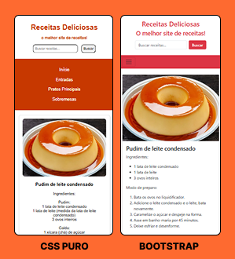

# Trabalho Prático - Semana 04 e 05

Dessa vez, vamos dar sequência ao projeto iniciado na semana passada. Se você ainda não fez o projeto da semana anterior, fique atento, se programe e procure colocar as atividades em dia. Volte lá, leia tudo e faça sua parte, pois essa atividade depende da atividade anterior.

Nessa atividade, vamos evoluir o projeto para que a home-page funcione bem tanto no celular quanto no desktop. Além disso, entenderemos como é o processo gradativo e colaborativo de desenvolvimento de um software, registrando cada etapa no histórico de commits do repositório do Git/GitHub.

**IMPORTANTE:** Você deve trabalhar e alterar apenas arquivos dentro da pasta **`public`**. Deixe todos os demais arquivos e pastas desse repositório inalterados. **PRESTE MUITA ATENÇÃO NISSO.**

## Informações Gerais

- **Nome:** Pedro Augusto Niess Ferreira
- **Matrícula:** 1540911
- **Proposta de projeto escolhida:** Site de receitas
- **Breve descrição sobre seu projeto:**
  - Este projeto é um site de receitas culinárias organizado por categorias, incluindo entradas, pratos principais e sobremesas.
  - Ele permite que os usuários busquem receitas pelo nome ou ingredientes, favoritem suas favoritas e visualizem detalhes completos de cada prato.
  - O design é inspirado em uma estética moderna e intuitiva, garantindo uma navegação agradável e eficiente.
  - Inicialmente, a responsividade foi implementada usando **CSS puro**, mas foi aprimorada com **Bootstrap** para melhor adaptação a diferentes dispositivos.

## Print de ambas as versões:

## Tecnologias Utilizadas

- HTML5
- CSS3
- Bootstrap 5
- Git/GitHub para controle de versão

## Melhorias Implementadas com Bootstrap

- Uso da grid do Bootstrap para melhor organização dos elementos
- Navbar responsiva com menu colapsável
- Cards estilizados para apresentação das receitas
- Botões e formulários com estilos padronizados
- Ajuste automático do layout para diferentes tamanhos de tela
